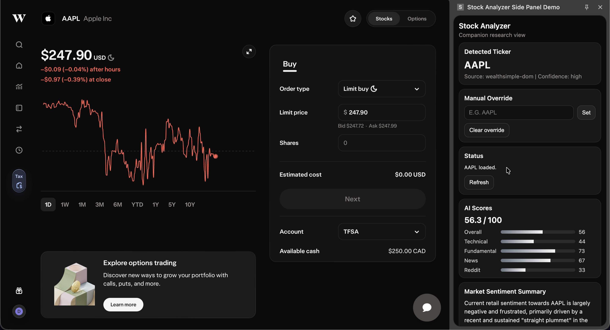

AI Stock Analyzer Proof of Concept
=================

### What this project does

This project analyzes a stock using:
- quantitative technical indicators,
- fundamental balance‑sheet and valuation metrics, and
- qualitative sentiment from Reddit and financial news,
into a single composite score for any stock ticker. It also generates LLM‑powered summaries for sentiment and fundamentals to explain the numbers.

The project now supports two interfaces:
- **Streamlit app** (`app.py`) for standalone analysis.
- **Chrome side panel extension** (`extension/`) that reads the active stock page ticker and displays analysis by calling the local API (`api/server.py`).

**NOTE: THIS IS A PROTOTYPE MEANT FOR AN APPLICATION, IN NO WAYS IS IT A COMPLETE OR FLESHED OUT PROJECT BUT RATHER A PROOF OF CONCEPT.**



### Main features

- Composite AI Score (0–100) – A single score blending technical strength, fundamental health, news sentiment, and Reddit sentiment (40% / 30% / 20% / 10%), with a gauge and breakdown in the UI.
- Price and sentiment chart – Last 30 days of closing price plus a bar chart of the current component scores (Technical, Fundamental, News, Reddit, Overall).
- Market sentiment summary – One-paragraph LLM summary of why Reddit and news are talking about the ticker the way they are.
- Fundamental audit – Key ratios (P/E, debt‑to‑equity, current ratio, margins, free cash flow), snapshot stats (market cap, 52W high/low, volume), and a one-paragraph LLM “auditor” take on balance sheet health and valuation risk.
- Raw feeds – Links to the top Reddit threads and news articles used in the analysis so you can dig deeper.

### Demo

- **Chrome extension** — [Demo video (Google Drive)](https://drive.google.com/file/d/1ycOiLT8wyI3wJ9KmxLETN0Z1sHFXKF7c/view?usp=drive_link)
- **Streamlit** — [Demo video (Google Drive)](https://drive.google.com/file/d/1LL_yvjtx9mHEtB88KVigfsCgzYOP5B9I/view?usp=drive_link)

### How to run it yourself

1. **Clone and create a virtual environment**
   ```bash
   git clone <this-repo-url>
   cd stock-analyzer
   python -m venv .venv
   source .venv/bin/activate  # Windows: .venv\Scripts\activate
   ```

2. **Install dependencies**
   ```bash
   pip install -r requirements.txt
   ```

3. **Create `.env` at the project root**
   ```env
   GEMINI_API_KEY=""
   NEWS_API_KEY=""
   ```

4. **Run the local API** (needed for the extension)
   ```bash
   uvicorn api.server:app --reload --port 8000
   ```

5. **Run the Streamlit app (optional standalone UI)**
   ```bash
   streamlit run app.py
   ```

### Chrome extension side panel

1. Open Chrome and go to `chrome://extensions`.
2. Enable Developer mode.
3. Click Load unpacked and select the `extension/` folder.
4. Open a stock page (tested only on Wealthsimple).
5. Open the extension side panel and click **Refresh**.

The extension will:
- detect the ticker from the active tab (with manual override available),
- call `http://localhost:8000/analyze`,
- render AI score breakdown, sentiment summary, fundamental audit, and source links.

### Important disclaimer

This is an educational research prototype. It does not provide investment advice and does not execute trades.

### What I considered

- **Financial perspective**
  - Technicals:
    - Momentum and trend (RSI, MACD, SMA‑20/50).
    - Volatility and price position (Bollinger Bands).
    - Short‑term buying pressure (VWAP).
  - Fundamentals:
    - Liquidity (current ratio).
    - Leverage (debt‑to‑equity).
    - Profitability (profit and operating margins).
    - Valuation (forward P/E) and cash generation (free cash flow).
  - Sentiment:
    - News and Reddit sentiment scores (separate).

### Integration with trading apps (e.g. Wealthsimple)

This project is built as a standalone research and education tool, not as a replacement for a broker. It fits alongside apps like **Wealthsimple**, **Questrade**, or **Robinhood**.

For deeper integration into apps like Wealthsimple, this should be positioned as a companion analytics layer that reduces context switching and improves retention, while staying educational (not advisory). A reasonable rollout would be to offer it to premium tiers first.

### Next steps

- Fix:
    - Using Reddit Dev feature directly rather than json requests, this way I stop getting rate limited (currently waiting approval)
    - Fine tune how the scoring works, adding more factors to take into consideration for equation
    - Not use Streamlit (Django or Flask in the future)
    - Fix edge cases for some symbols (e.g., POW).
    - Improve token/rate-limit handling (HF_Token).
- Add:
    - Options Data + Earnings suprises for trends
    - More graphs !!!
    - Portfolio mode: User connects to their investment portfolio using snaptrades api and can view multiple stocks side by side
    - Learning: Users can have scenario prompts, like how would a rate cut affect this stock, via Gemini

### Tech stack

- Language: Python
- UI: Streamlit
- Extension UI: Chrome Extension (Manifest V3, HTML/CSS/JS)
- Local API: FastAPI + Uvicorn
- Market Data: yfinance
- Technical Indicators: Pandas Ta
- Social Data: Reddit JSON requests
- News Data: NewsAPI
- Sentiment Analysis: FinBERT
- LLM: Gemini SDK
- Charts: Plotly
