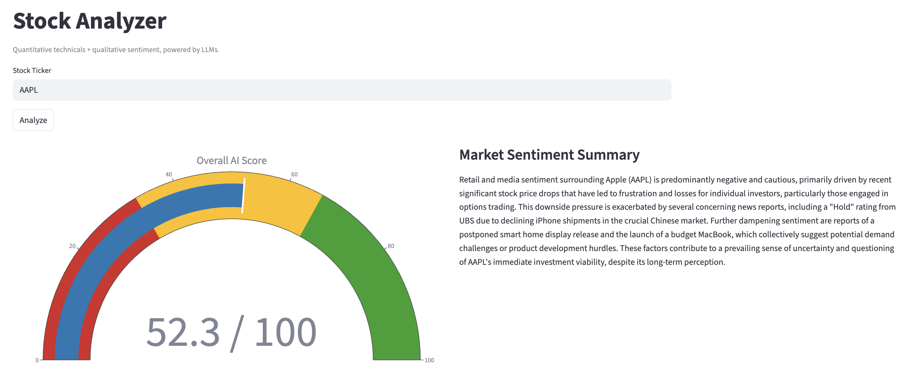
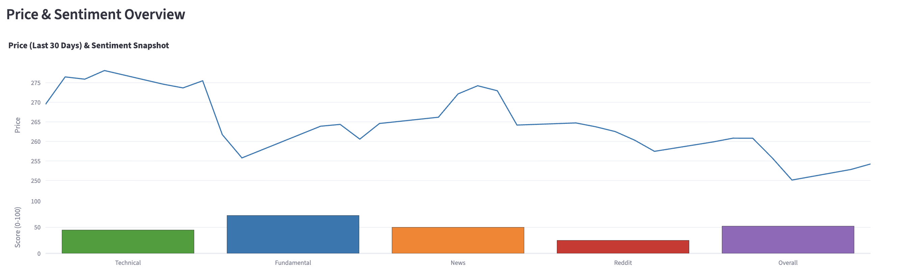
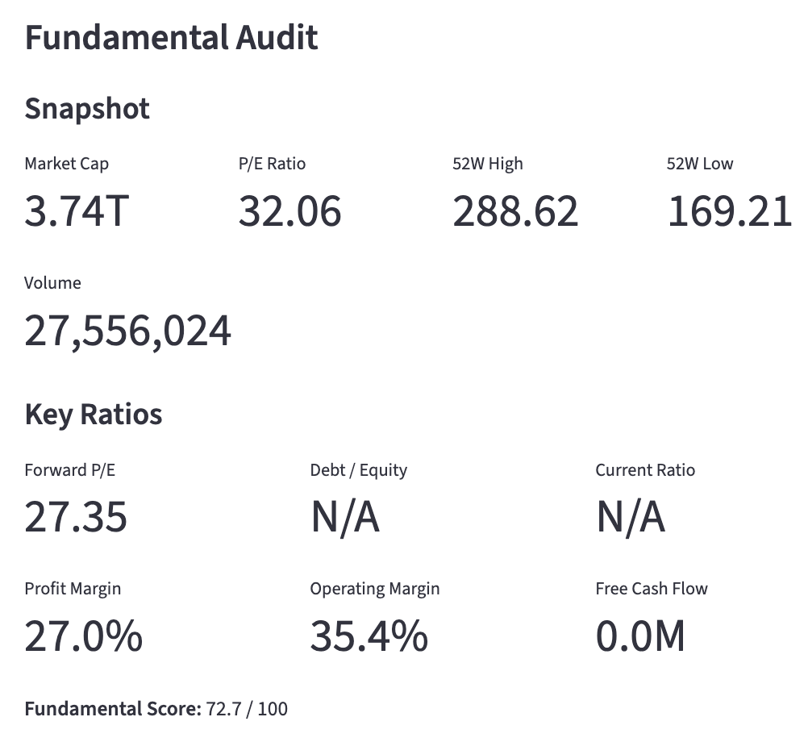
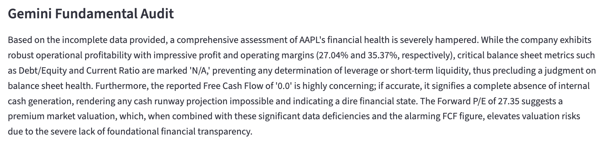
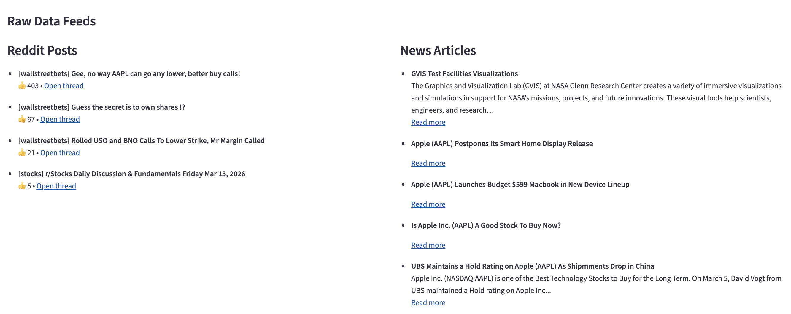

AI Stock Analyzer Proof of Concept
=================

### What this project does

This Stock Analyzer is a Streamlit web app that combines:
- quantitative technical indicators,
- fundamental balance‑sheet and valuation metrics, and
- qualitative sentiment from Reddit and financial news,
into a single composite score for any stock ticker. It also generates LLM‑powered summaries for sentiment and fundamentals to explain the numbers.

**NOTE: THIS IS A PROTOTYPE MEANT FOR AN APPLICATION, IN NO WAYS IS IT A COMPLETE OR FLESHED OUT PROJECT BUT RATHER A PROOF OF CONCEPT.**

 
 


### Main features

- Composite AI Score (0–100) – A single score blending technical strength, fundamental health, news sentiment, and Reddit sentiment (40% / 30% / 20% / 10%), with a gauge and breakdown in the UI.
- Price and sentiment chart – Last 30 days of closing price plus a bar chart of the current component scores (Technical, Fundamental, News, Reddit, Overall).
- Market sentiment summary – One-paragraph LLM summary of why Reddit and news are talking about the ticker the way they are.
- Fundamental audit – Key ratios (P/E, debt‑to‑equity, current ratio, margins, free cash flow), snapshot stats (market cap, 52W high/low, volume), and a one-paragraph LLM “auditor” take on balance sheet health and valuation risk.
- Raw feeds – Links to the top Reddit threads and news articles used in the analysis so you can dig deeper.

### Demo

`[INSERT DEMO LINK HERE]`

### How to run it yourself

1. **Clone and create a virtual environment**
   ```bash
   git clone <this-repo-url>
   cd stock-analyzer
   python -m venv .venv
   source .venv/bin/activate  # Windows: .venv\Scripts\activate
   ```

2. **Install dependencies**
   ```bash
   pip install -r requirements.txt
   ```

3. **Create `.env` at the project root**
   ```env
   GEMINI_API_KEY=""
   NEWS_API_KEY=""
   ```

4. **Run the Streamlit app**
   ```bash
   streamlit run app.py
   ```

### What was taken into consideration

- **Financial perspective**
  - Technicals:
    - Momentum and trend (RSI, MACD, SMA‑20/50).
    - Volatility and price position (Bollinger Bands).
    - Short‑term buying pressure (VWAP).
  - Fundamentals:
    - Liquidity (current ratio).
    - Leverage (debt‑to‑equity).
    - Profitability (profit and operating margins).
    - Valuation (forward P/E) and cash generation (free cash flow).
  - Sentiment:
    - using news and reddit scores (seperate)

### Integration with existing trading apps (e.g. Wealthsimple)

This project is built as a standalone research and education tool, not as a replacement for a broker. It fits alongside apps like **Wealthsimple**, **Questrade**, or **Robinhood**.

For full integration into apps such as Wealthsimple, it should be positioned as a companion analytics layer to reduce switching apps (increasing user retention) meant as a educational resource rather than advisory role. To monetize, companies should:
    - Only allowing certain users such as card holders, premium users etc (In Wealthsimple's case)

### What’s next (future roadmap)

- Fix:
    - Using Reddit Dev feature directly rather than json requests, this way I stop getting rate limited (currently waiting approval)
    - Fine tune how the scoring works, adding more factors to take into consideration for equation
    - Not use Streamlit (Django or Flask in the future)
    - Error with certain stocks like POW (doesn't actually look at the stock...)
- Add:
    - Options Data + Earnings suprises for trends
    - More graphs !!!
    - Portfolio mode: User connects to their investment portfolio using snaptrades api and can view multiple stocks side by side
    - Learning: Users can have scenario prompts, like how would a rate cut affect this stock, via Gemini

### Tech stack

- Language: Python
- UI: Streamlit
- Market Data: yfinance
- Technical Indicators: Pandas Ta
- Social Data: Reddit JSON requests
- News Data: NewsAPI
- Sentiment Analysis: FinBERT
- LLM: Gemini SDK
- Charts: Plotly